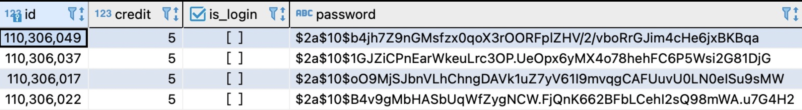

keywords: api, spring boot
# This repo is final project of my NCCU OOP course.
This server is for reserving laundry machines in student dorms.

### Create new account
method: post
url: http://laundry-ordering.herokuaoo.com/user/create
Request Body:
> {
>	id: 110306017
>	password: 0000
> }
### Login
method: post
url: http://laundry-ordering.herokuaoo.com/user/login
Request Body:
> {
>	id: 110306017
>	password: 0000
> }

if success...
Response:
> {
>	token: “d9e4c405b90d4ced88e9ed1027e5c7c5”,
>	msg: “Successfully login”
> }
### Get available reservations
method: get
url: http://laundry-ordering.herokuaoo.com/reservation/get-available-reservations?date=2020-04-23
### Reserve
method: post
url: http://laundry-ordering.herokuaoo.com/user/reserve
Request Body:
> {
>	id: 110306017,
>	token: ““d9e4c405b90d4ced88e9ed1027e5c7c5”, time: “2022-04-23 20:00”
> }
Response:
> {
>	id: 1, // id of the reservation
>	machine_num: 1
> }
### Cancel reservation
method: post
url: http://laundry-ordering.herokuaoo.com/reservation/delete
Request Body:
> {
>	user_id: 110306017,
>	token: “d9e4c405b90d4ced88e9ed1027e5c7c5”, reservation_id: 1
> }

### Change user password
method: post
url: http://laundry-ordering.herokuaoo.com/user/change-password
Request Body:
> {
>	id: 110306017,
>	old_password: “0000”,
>	new_password: “00000”
> }
### Logout
method: post
url: http://laundry-ordering.herokuaoo.com/user/logout
Request Body:
> {
>	id: 110306017,
>	password: “0000”
> }
---
### Password Encryption
code: [here](https://github.com/y1lichen/Laundry-Ordering-System/blob/main/src/main/java/com/jefferson/laundryorderingsystem/utils/ApplicationPasswordEncoder.java)
The password is encrypted by bcrypt in database.

### Data Cleanup
The expired reservations will be automatically removed.
The original approach is to set up a scheduler and delete the data at 00:00 every day.
However, the heroku server will shut down at 30 minutes after interactions, and the scheduler won't be trigger correctly.
Resolution:
Everytime the server wake up, the ContextRefreshedEvent will occur.
The resolution is to listen to ContextRefreshedEvent and removed expired data when ContextRefreshedEvent occur.